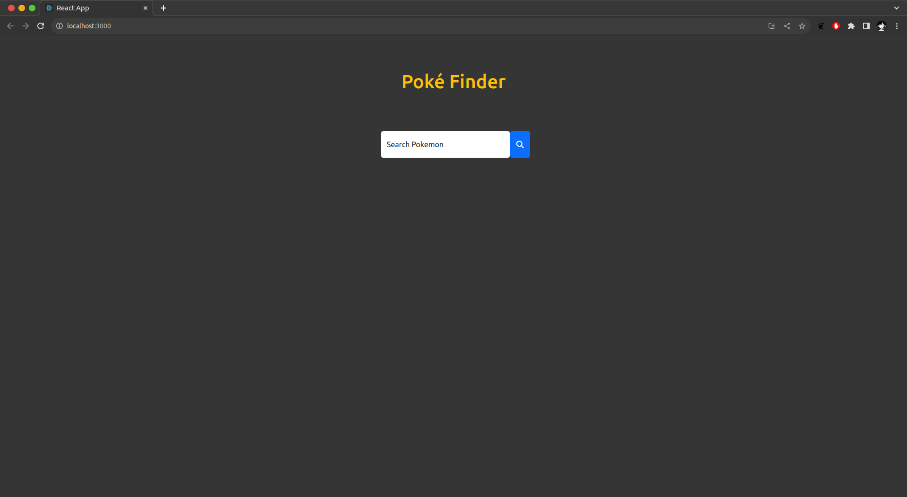
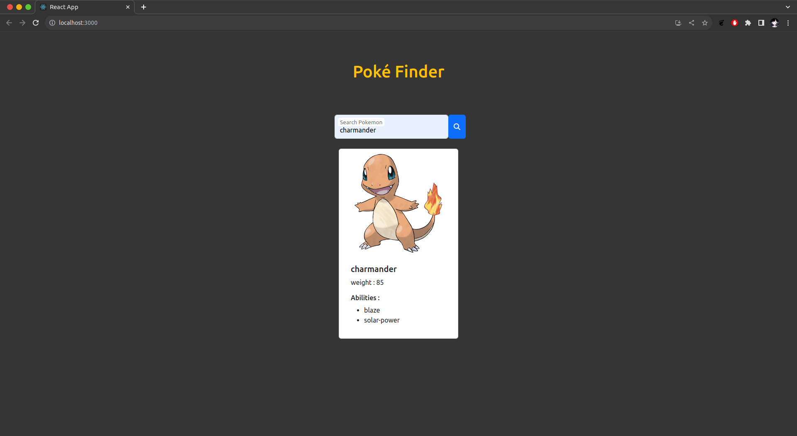
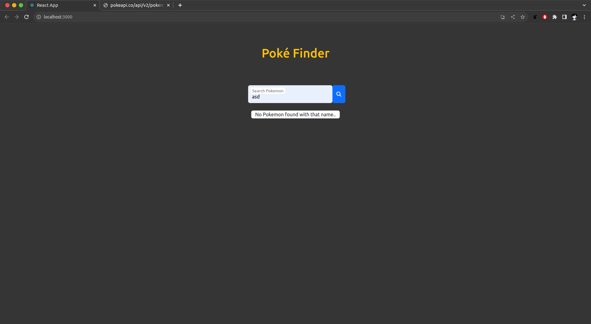
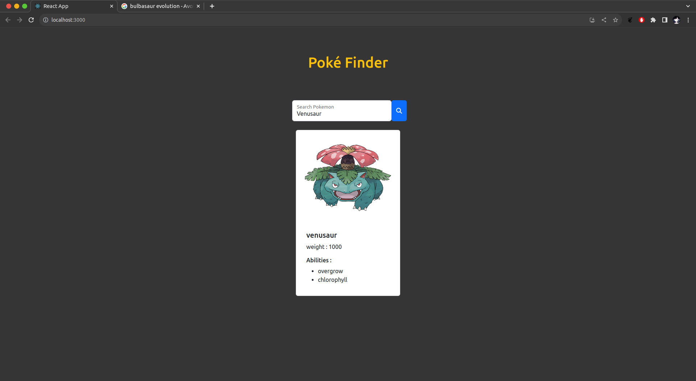
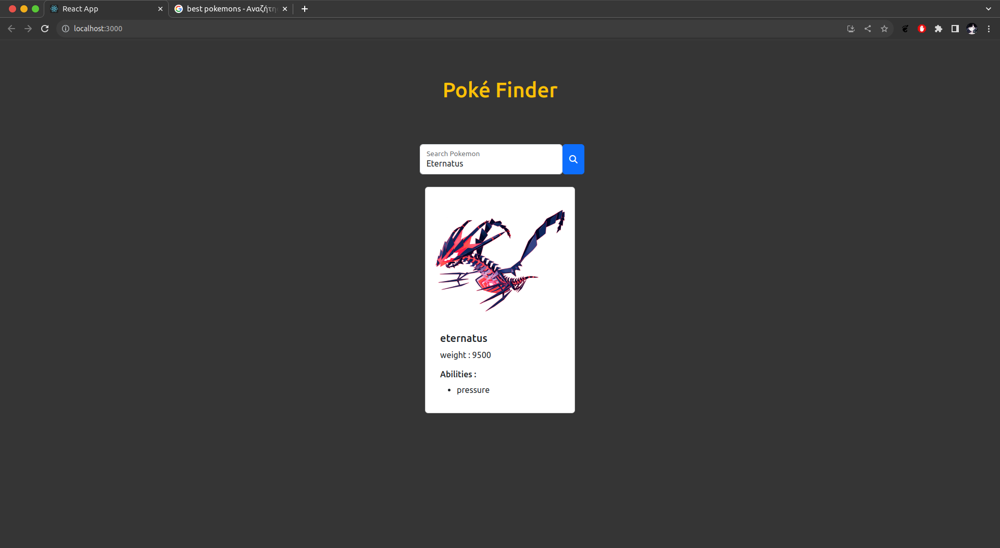

# PokeFinder

PokeFinder is a Web App created with React library for finding Pokemons , like a pokedex

# UI of the App

&nbsp;&nbsp;

&nbsp;&nbsp;

&nbsp;&nbsp;

&nbsp;&nbsp;

&nbsp;&nbsp;


## Requirements
- NodeJS
- npm
- jQuery
- bootstrap
## Installation
- Clone the reposetory

```
$ git clone https://github.com/iee-ihu-gr-course1941/ADISE22_PINNACLE.git
```
- Install [NodeJS](https://nodejs.org) 
- Install [npm](https://www.npmjs.com/) (Node Package Manager)

```
$ sudo apt install nodejs npm
```

- Install [Bootstrap](https://getbootstrap.com/)

```
$ npm install bootstrap
```
- Install [jQuery](https://jquery.com/)
```
$ npm install jquery
```

## App description
 
- The project is divided to 4 components :
  - Container.js
  - Card.js
  - Header.js
  - Pokemon.js

- Container.js is a wraper Component for all the content and it passes props.children. 

  - it is called and used on App.js on the return statement as a wraper component.

- Header.js Component includes the header name of the App and the search form , so the user can write and search a pokemon of his choice.

- Card.js is a wraper Component as well and it is re-used in 2 cases on the App. Once on App.js to render an error , and on Pokemon.js Component to render the pokemon.

- Pokemon.js includes and renders the pokemon that was fetched by the [PokeAPI](https://pokeapi.co/). Renders a image , a header (name of pokemon) , the weight and the abilities of the pokemon.

## Fetching Data

- In App.js , the data is fetched using jQuery javascript library with AJAX technique that provides.
  
  - Using the Poke API url and adding to the url the pokemon of the input , it returns data in JSON format.
  
  - Then the data is saved in a state hook called 'pokemon'.

- At the end pokemon state hook is passed as props in Pokemon component , to render those data. 